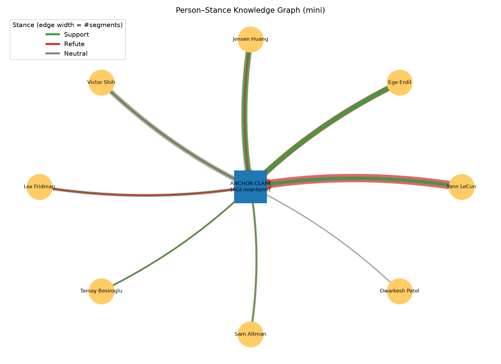

# PROGRESS — LexiCore AGI-Discourse

Bu dosya, progress report sonrası bu sprintte yapılan işleri **adım adım** kaydeder.
Amaç: sprint raporunu / final paper'ı yazarken buradaki sıralı geçmişten ve
sonuçlardan faydalanmak. Her adımda "ilk durum → ne yaptık → ne oldu" var.

---

## 0. Başlangıç durumu (progress report anı)

- **4 video**, **302 segment** (90 saniyelik zaman-penceresi segmentasyonu).
- Etiketleme: zero-shot LLM (speaker + claim + stance), tümü "silver" etiket.
- Baseline: TF-IDF + Logistic Regression, **stance Macro-F1 = 0.507**.
- Knowledge graph: sadece **"planned"** (kod yoktu).
- Claim classification: sadece görev olarak tanımlıydı, sonucu yoktu.

---

## 1. Knowledge graph — "planned" → çalışan bileşen

**İlk durum:** Graf sadece plandı, kodu yoktu.

**Ne yaptık:** `src/build_graph.py` yazıldı. Etiketli segmentlerden bir
**person–stance grafı** kuruyor:
- Her konuşmacı bir **person düğümü**, tek bir **anchor claim düğümü**.
- Her `(konuşmacı, stance)` ikilisi, segment sayısıyla ağırlıklı bir **kenar**.
- "Unknown" konuşmacılar grafın dışında bırakılıyor (graf temiz kalsın).
- Teknoloji: Python + `networkx` + `matplotlib`.
- Çıktı: `data/graph/person_stance_graph.json` (node/edge) + `data/graph/graph.png`.

**Ne oldu:** İlk çalışan graf elde edildi. Sam Altman baskın Support,
Yann LeCun / Ege Erdil baskın Refute — kişilerin bilinen görüşleriyle tutarlı.

---

## 2. Claim classification — ikinci NLU görevi için baseline

**İlk durum:** Sadece stance görevinin skoru vardı.

**Ne yaptık:** `src/train_claim_baseline.py` yazıldı. `is_claim` etiketini
kullanarak claim / no-claim ikili sınıflandırması yapıyor (stance baseline'ı ile
aynı TF-IDF + Logistic Regression yapısı).

**Ne oldu:** Claim classification için ilk baseline: **Macro-F1 = 0.749**.

---

## 3. Veri genişletme — 5. video (hedefli)

**İlk durum:** 4 video / 302 segment. En zayıf sınıf **Refute** (58 örnek, F1 0.378).

**Ne yaptık:** En az temsil edilen Refute sınıfını güçlendirmek için **bilinçli
olarak** bir AGI-skeptik konuşmacı seçtik: **Yann LeCun** (Lex Fridman Podcast,
~167 dk). Altyazı `youtube-transcript-api` ile çekilip segmentlere bölündü ve
zero-shot LLM (OpenAI gpt-4o-mini) ile etiketlendi.

**Ne oldu:** Veri seti **5 video / 412 segment**'e çıktı. **Refute 58 → 115**
(neredeyse 2 katı). Refute F1 **0.378 → 0.496** yükseldi. Hedefli genişletme
işe yaradı.

---

## 4. Semantic segmentation — 90sn zaman-penceresi → anlam-tabanlı bölme

**İlk durum:** Segmentler saf zaman-penceresiyle (90sn) kesiliyordu. Sorun:
segmentlerin sadece **%45'i** düzgün cümle sonunda bitiyordu; birçoğu cümle/
konuşmacı ortasından kesiliyordu → karışık segment → yüksek "Unknown" ve
bulanık stance.

**Ne yaptık:** `segment_semantic()` fonksiyonu eklendi (`src/fetch_transcripts.py`).
Mantık: bir segment **min süreye** ulaşınca ve bir **doğal kesim noktası**
(uzun duraklama = konuşmacı/konu değişimi sinyali VEYA cümle sonu `.?!`) gelince
böl. Yani "zaman zemin, anlam kesim noktası". Eski `segment_baseline()`
karşılaştırma için korundu.

**Ne oldu (parametre ablasyonu):**

| Sürüm | Segment | Cümle-sonu temizliği | Stance F1 | Claim F1 | Neutral | Unknown |
|---|---|---|---|---|---|---|
| 90sn baseline | 412 | 45% | 0.519 | 0.749 | 46% | 22% |
| semantic min=30 | 961 | 95% | 0.503 | 0.749 | 65% | 23% |
| **semantic min=60** | **546** | ~90% | **0.562** | **0.782** | 53% | **16%** |

- **min=30 çok kısaydı:** bağlam parçalandı, Neutral %65'e fırladı, skor düştü.
  Ders: "daha temiz her zaman daha iyi değil" — segment uzunluğu kritik parametre.
- **off-topic filtreleme denendi, işe yaramadı:** off-topic'leri baseline'dan
  çıkarınca skor düştü (0.519 → 0.457), çünkü onlar modelin kolay Neutral
  örnekleriydi. (Negatif sonuç da bir bulgu.)
- **min=60 en iyi sürüm:** her metrik iyileşti — en yüksek stance (0.562) ve
  claim (0.782) skoru, en az Unknown (%16), dengeli Neutral.

---

## 5. Ara durum (bölüm 1-4'ün sonu — güncel rakamlar için bölüm 10'a bakınız)

- **5 video**, **546 semantic segment** (min=60, ~67 sn ortalama), tümü etiketli.
- **Stance Macro-F1 = 0.562** | **Claim Macro-F1 = 0.782** (5-fold CV).
- Knowledge graph: **9 kişi düğümü + 1 anchor**, 23 ağırlıklı stance kenarı.
- Kod artık `main`'e merge edildi (eski `eylul` ve `claim-clustering-embedding`
  branch'leri); API anahtarları `.gitignore` ile korunuyor.

### Stance dağılımı (546 segment)

| Sınıf | Sayı | Oran |
|---|---|---|
| Neutral | 292 | 53% |
| Support | 128 | 23% |
| Refute | 126 | 23% |

### Knowledge graph (son hali)



*Yeşil: Support, Kırmızı: Refute, Gri: Neutral; kenar kalınlığı = segment sayısı.*
*Not: kenarlar üst üste bindiği için görselde stance ayrımı her zaman net
okunmuyor (mini graf sınırı); baskın stance için aşağıdaki tabloya bakınız.*

### Konuşmacı bazlı baskın duruş

| Konuşmacı | Segment | Support | Refute | Neutral | Baskın |
|---|---|---|---|---|---|
| Ege Erdil | 130 | 35 | 44 | 51 | Neutral |
| Yann LeCun | 108 | 22 | 44 | 42 | **Refute** |
| Jensen Huang | 84 | 32 | 5 | 47 | Neutral |
| Lex Fridman | 49 | 9 | 11 | 29 | Neutral |
| Victor Shih | 48 | 3 | 8 | 37 | Neutral |
| Sam Altman | 21 | 14 | 2 | 5 | **Support** |
| Tamay Besiroglu | 11 | 5 | 4 | 2 | **Support** |

---

## 6. Kanonik claim clustering — tek anchor → çok-claim'li grafa geçiş

**İlk durum:** Graf tek bir "anchor claim" düğümü kullanıyordu; ham claim'ler
gruplanmamıştı.

**Ne yaptık:** 546 segmentteki **359 ham claim** iki yöntemle kanonik claim'lere
gruplandı ve karşılaştırıldı:
- `src/cluster_claims.py` — **TF-IDF + KMeans** (topic-tabanlı, yüzeysel kelime örtüşmesi).
- `src/cluster_claims_embed.py` — **sentence-transformer embedding** (`all-MiniLM-L6-v2`)
  + KMeans (anlam-tabanlı).
- Her iki çıktı `data/graph/canonical_claims.json` ve `canonical_claims_embed.json`
  (20'şer küme, küme başına kanonik claim + üyeler).

**Ne oldu:** İki yöntem de 359 claim'i 20 kanonik başlığa indirdi. Embedding
yöntemi anlamca yakın ama farklı kelimelerle ifade edilmiş claim'leri daha iyi
topluyor; TF-IDF ise yüzeysel kelime örtüşmesine takılıyor. Bu, tek-anchor
grafından gerçek çok-claim'li person–claim–stance grafına geçişin altyapısı.

---

## 7. BERT student model — silver etiketlerden distillation

**İlk durum:** Sadece TF-IDF + LogReg stance baseline'ı vardı (Macro-F1 0.562).

**Ne yaptık:** `src/train_bert_stance.py` yazıldı. LLM silver stance etiketlerinden
**DistilBERT** (`distilbert-base-uncased`) fine-tune ediliyor — "teacher LLM →
küçük BERT student" distillation. Eğitim RTX 3050 GPU'da. Baseline ile **aynı
5-fold CV** metodolojisi kullanıldı.

- **Dengesizlik tuzağı:** düz cross-entropy ile model çoğunluk sınıfına (Neutral)
  çöktü → Macro-F1 **0.233** (hepsini Neutral tahmin etti). Baseline'daki gibi
  **balanced class-weighted cross-entropy** eklenince model üç sınıfı da öğrendi.

**Ne oldu:**

| Model | Metod | Stance Macro-F1 |
|---|---|---|
| Majority-class | — | ~0.23 |
| DistilBERT (düz CE) | 5-fold CV | 0.233 (çöktü) |
| DistilBERT (weighted CE, 6 epoch) | 5-fold CV | **0.518** |
| **TF-IDF + LogReg (baseline)** | 5-fold CV | **0.562** |

**Bulgu (o tarihte):** DistilBERT (0.518) bu veri setinde tuned TF-IDF
baseline'ı (0.562) **geçemedi**. Öne sürülen neden: sadece **546 örnek**
(transformer fine-tune için çok küçük), **silver** (gürültülü) etiketler ve
sınıf dengesizliği.

DistilBERT sınıf-bazlı (5-fold CV): Support F1 0.518, Refute 0.437, Neutral 0.597.

> **⚠️ Bu negatif sonuç bölüm 14'te geçersiz kılındı.** Veri 546 → 2782'ye
> çıkınca DistilBERT 0.583'e, BERT-base 0.606'ya ulaşıp baseline'ı geçti.
> "Veri azlığı" hipotezi doğrulandı; yukarıdaki 0.518 rakamı artık tarihsel
> kayıttır, güncel stance sonucu için bölüm 14'e bakın.

---

## 8. Gold etiketleme altyapısı — insan doğrulaması (human-in-the-loop)

**İlk durum:** Tüm etiketler silver'dı (LLM); gerçek (gold) test seti ve
LLM–insan uyum ölçümü yoktu.

**Ne yaptık (altyapı hazır, veri toplanacak):** Sıfırdan elle etiketlemek yerine
**LLM ön-etiketi + insan düzeltmesi** akışı kuruldu:
- `src/label_manual.py` — Streamlit aracı: her segmenti silver etiket **önceden
  dolu** gösterir; insan speaker/is_claim/claim/stance/topic'i onaylar veya
  düzeltir. Düzeltilen segment `reviewed: true` ile `data/gold/`'a yazılır,
  orijinal silver değer `*_silver` altında saklanır.
- `src/compute_agreement.py` — silver vs gold **Cohen's κ** + doğruluk +
  stance confusion matrix.

**Plan:** 20 yeni video eklenecek. ~2200 segmentin hepsi elle yapılmayacak;
**stratified ~400-500 segment** elle doğrulanıp **gold test seti** olacak, kalanı
BERT eğitimi için silver kalacak. κ değeri silver etiketlerin güvenilirliğini
raporlayacak.

---

## 9. Şartname hizalaması — 3 çekirdek görev + graf + retrieval

**İlk durum:** Resmi proje tanımına (Project ID 1) göre eksikler vardı: claim
görevi binary'di (multi-label değil), speaker/graf/retrieval değerlendirmesi
yoktu. Her yeni özellik **ayrı feature branch**'te geliştirilip main'e merge edildi.

**Ne yaptık:**
- **Görev 1 — Speaker identification** (`train_speaker.py`): TF-IDF baseline +
  class-weighted DistilBERT. 5 videoda **TF-IDF 5-fold Macro-F1 = 0.693**
  (accuracy 0.847; Unknown ve seyrek konuşmacılar hariç).
- **Görev 2 — Multi-label canonical claim classification**: 20 embedding
  kümesinden **14 kategorilik kanonik taksonomi** (`claim_taxonomy.py`) türetildi;
  `label_segments.py` artık her segmente multi-label `claim_labels` üretiyor;
  `label_manual.py`'ye çoklu-seçim eklendi; `assign_claim_labels.py` embedding ile
  silver multi-label bootstrap yapıyor; model `train_claim_multilabel.py`
  (DistilBERT sigmoid+BCE ve TF-IDF OvR baseline).
- **Görev 5 — Person–claim–stance grafı** (`build_graph_full.py`): tek anchor
  yerine kanonik claim kategorileri düğüm; person→claim kenarları stance dağılımı
  taşıyor.
- **Görev 6-8 — Stance-aware retrieval** (`eval_retrieval.py`): labels'tan
  (claim × stance) sorgu seti + qrels; **BM25 / dense / hybrid / stance-aware**
  karşılaştırması, **MRR ve nDCG@10**.
- **Görev 9 — Graf doğrulama** (`graph_judge.py`): LLM-as-a-judge kenar denetimi
  (yapısal bütünlük oranı).

**Not:** Multi-label claim, retrieval ve full-graf, `claim_labels` alanının dolu
olmasını ister — `assign_claim_labels.py` (bootstrap) veya güncellenmiş
`label_segments.py` çalıştırıldıktan sonra sonuç üretirler.

---

## 10. Veri genişletme — "AGI DISCOURSE" playlist'i (5 → 23 video)

**İlk durum:** 5 video / 546 segment. Bölüm 8-9'da planlanan "20 video ekle"
adımı bekliyordu. En zayıf sınıf **Refute** (126 örnek, F1 0.496).

**Ne yaptık:** 18 yeni video eklendi. Playlist'i toplu çekmek YouTube'un IP
rate-limit'ine takıldığı için **video-başına** bir akış kuruldu (`add_video.sh`):
transcript çek → segmentle → tek video etiketle, her adım idempotent. Böylece
yarıda kalan iş baştan başlamıyor ve her videonun sonucu tek tek denetlenebiliyor.

**Ne oldu:** **23 video / 2782 segment** (5.1 katı). Kaynak dağılımı bilinçli
olarak iki kutuplu seçildi: AGI-skeptik / x-risk tarafı (Yudkowsky, Yampolskiy ×3,
Tegmark, Leahy, Bengio, MacAskill, Rohin Shah) ve iyimser / geliştirici tarafı
(Amodei ×3, Hassabis, Schulman, Karpathy).

### Skorlar (5-fold CV, aynı metodoloji)

| Görev | 546 segment | 2782 segment |
|---|---|---|
| **Stance Macro-F1** | 0.562 | **0.566** |
| — Refute F1 | 0.496 | **0.594** |
| — Neutral F1 | ~0.75 | 0.678 |
| — Support F1 | — | 0.425 |
| **Claim Macro-F1** | 0.782 | 0.771 |

**Asıl kazanım toplam skorda değil, Refute'ta:** 0.496 → **0.594**. Refute artık
en zayıf değil, en güçlü ikinci sınıf. Sınıf dağılımı da dengelendi:
Neutral %53 → **%45**, Refute %23 → **%33**.

**Ara ölçüm yanıltıcı çıktı (kaydetmeye değer):** 1328 segmentte Refute F1
**0.442'ye düştü** ve "TF-IDF kapasite sınırına vurdu" diye yorumlandı. Veri iki
katına daha çıkınca 0.605'e yükseldi — yani bu bir plato değil, geçici bir çukurdu.
Ders: veri genişletmede tek ara ölçümden model kapasitesi hakkında sonuç çıkarmamak.

**Yeni zayıf halka Support (F1 0.437, 602 örnek)** — en az temsil edilen sınıf.
Sonraki hedefli genişletme buraya yönelmeli. Claim skoru pratikte sabit (0.774);
claim oranı %68 → %76 çıktığı için `no-claim` sınıfı zorlaştı (F1 0.649).

### Konuşmacı tabanı: 9 → 23 kişi (10+ segment)

En zengin düğümler: **Dario Amodei 415** (3 video), **Roman Yampolskiy 268**
(3 video), Will MacAskill 179, Ege Erdil 130, Max Tegmark 123.

**Aynı kişi, farklı bağlamda farklı duruş** — Amodei üç videoda:

| Video | Segment | Support | Refute | Neutral |
|---|---|---|---|---|
| Lex #452 | 249 | %25 | %22 | %53 |
| Dwarkesh (hidden pattern) | 76 | %9 | **%53** | %38 |
| Dwarkesh (exponential) | 90 | %32 | %37 | %31 |

Tek "baskın stance" etiketi bu kişiyi temsil etmiyor. Bu, tek-anchor ölçümünün
sınırını gösteren somut kanıt ve bölüm 6'daki kanonik claim'lere geçişi destekliyor.

---

## 11. Etiketleme kalitesi — süreçte çıkan 4 teknik bulgu

Videolar tek tek eklendiği için her birinin Unknown oranı ayrıca görüldü; bu da
konuşmacı atamasının nelere duyarlı olduğunu ortaya çıkardı.

**1. `VIDEO_META` roster'ı zorunlu.** Roster tanımsız videoda model isim
üretemiyor: ilk denemede 152 segmentin **%90'ı Unknown**. Videonun host/guest'i
`VIDEO_META`'ya eklenince aynı video **%17**'ye indi. Roster'lı videolarda
tipik oran %7-17.

**2. Uydurma placeholder isim zarar veriyor.** Sunucusu bilinmeyen videolarda
host olarak `"Interviewer"` yazılınca Unknown **%78** çıktı — model listedeki
sahte ismi kullanmak yerine Unknown'a düşüyor. Roster'ı **konuk-tek** bırakmak
(host = gerçek konuşmacı, guests = []) aynı videoyu **%10**'a indirdi.

**3. Otomatik (ASR) altyazı segmentasyonu bozuyor.** `segment_semantic()` iki
kesim sinyali kullanıyor: cümle sonu `.?!` veya ≥1.5sn duraklama. ASR
altyazılarda ikisi de yok — Yudkowsky videosunda 5195 satırın **1'i** noktalama
içeriyordu, ≥1.5sn duraklama sadece 16 taneydi. Sonuç: her segment `max_sec`'e
dayanıyor ve 198 dakikalık video **67 segmente** (ort **177sn**) bölünüyor,
diğer videolarda ort 67sn. Parametre taramasıyla `max_sec=90, pause_sec=0.4`
seçildi → **130 segment (ort 93sn)**. Aynı sorun 3 videoda çıktı (Yudkowsky,
Bengio, METR); `add_video.sh` artık noktalama oranını ölçüp %10'un altındaysa
sıkı eşiklere kendisi geçiyor.

**4. Çok konuşmacılı format yapısal sınır.** METR videosunda 3 konuşmacı var ve
altyazıda geçişler yalnızca `>>` ile işaretli, isim geçmiyor (transcript'te
"Beth" 4, "David" 1 kez). Unknown **%80**'de kaldı, roster'la düzelmedi.
3 kişilik Lex #490 panelinde de %38. Karşılaştırma: ikili sohbetlerde %2-15.
Segmentler stance/claim modelleri için tutuldu; Unknown oldukları için grafa
katkı vermiyorlar.

**Genel Unknown oranı %17** (546 segmentte %16'ydı) — veri 5 katına çıkarken
konuşmacı ataması bozulmadı.

---

## 12. Genişlemiş veriyle pipeline — graf, retrieval, çekirdek görevler

**İlk durum:** Bölüm 9'daki bileşenler 546 segmentle yazılmıştı; graf 9 kişi +
tek anchor'dı.

### `claim_labels` kalitesi — düzeltilen bir etiketleme hatası

Graf ilk kurulduğunda **en güçlü kenarların hepsi "Other / Off-topic"** çıktı.
Sebep: `claim_labels`'ta `other` oranı **%75**. Kırılım suçluyu gösterdi —
LLM'in kendi etiketlediği yeni videolarda **%89**, embedding bootstrap'ının
işlediği eski videolarda %45. Yani model 14 kategori arasından seçim yapmak
yerine `other`'a kaçıyordu (claim içeren 1444 segmentte bile).

Çözüm: `assign_claim_labels.py --overwrite` ile tüm 2782 segment embedding
benzerliğiyle yeniden atandı. İlk denemede eşik (0.3) fazla gevşek kaldı —
segment başına **5.1 kategori** düştü ve kategori ayrımı kayboldu (Amodei 9
kategoride üst üste "Refute" göründü). Eşik taramasıyla **threshold=0.45**
seçildi: segment başına **2.0 kategori** (`topk=2` ile tutarlı), `other` **%24**.

**Ders:** taksonomi etiketlerinde iki yönlü hata var — LLM tembelleşip `other`'a
kaçıyor, gevşek eşikli embedding ise her segmente her kategoriyi veriyor.
İkisi de grafı okunamaz yapıyor, ama farklı biçimde.

### Person–claim–stance grafı (`build_graph_full.py`)

**28 kişi düğümü + 14 kanonik claim kategorisi, 355 kenar** (önceki: 9 kişi +
1 anchor, 23 kenar). Baskın stance'ler kişilerin bilinen duruşlarıyla tutarlı:

| Kişi | Claim kategorisi | Segment | Baskın |
|---|---|---|---|
| Dario Amodei | AI Optimism & Human Benefit | 198 | Refute |
| Roman Yampolskiy | AI Optimism & Human Benefit | 168 | Refute |
| Dario Amodei | Scaling & Compute | 155 | Neutral |
| Roman Yampolskiy | AI Safety & Risk | 119 | Refute |
| Will MacAskill | AI Optimism & Human Benefit | 104 | **Support** |
| Max Tegmark | AI Optimism & Human Benefit | 87 | Refute |
| Dario Amodei | AGI Timeline | 76 | **Support** |
| Eliezer Yudkowsky | AI Optimism & Human Benefit | 61 | Refute |

Amodei profili özellikle ayırt edici: **AGI Timeline ve AI Economics'te Support,
AI Safety'de Refute** — Anthropic CEO'su için beklenen tutum, tek bir "baskın
stance" etiketiyle temsil edilemeyecek bir yapı.

**Görselin sınırı:** `graph_full.png` 28×14 düğüm ve 355 kenarla okunamaz
yoğunlukta (kenarlar üst üste biniyor, kategori etiketleri kırpılıyor). Graf
verisi `person_claim_stance_graph.json`'da sağlam; rapora görsel koyacaksak
ya en güçlü N kenarla filtrelenmiş bir alt-graf ya da yukarıdaki gibi tablo
kullanmak gerekiyor.

### Çekirdek görev skorları (genişlemiş veri)

| Görev | 546 segment | 2782 segment |
|---|---|---|
| Speaker identification (TF-IDF) | 0.693 | **0.659** (accuracy 0.811) |
| Multi-label claim (TF-IDF OvR) | — | **macro 0.365** / micro 0.494 |

Speaker skoru düştü (0.693 → 0.659) çünkü sınıf sayısı 9'dan **25**'e çıktı —
seyrek konuşmacılar (Dwarkesh Patel 11, Sebastian Raschka 14 segment) macro
ortalamayı aşağı çekiyor. Accuracy 0.811 ile yüksek kalıyor.

Multi-label claim macro-F1 **0.365** düşük ve sınıf başına çok değişken:
`ai_optimism_benefit` 0.651 (1258 örnek) vs `intelligence_nature` 0.044
(43 örnek), `geopolitics` 0.157 (38 örnek). Sorun sınıf dengesizliği —
taksonominin uzun kuyruğu eğitilemiyor.

### Retrieval (`eval_retrieval.py`)

26 sorgu (claim × stance, her biri ≥3 ilgili), 2782 segment korpus:

| Yöntem | MRR | nDCG@10 |
|---|---|---|
| BM25 | 0.424 | 0.220 |
| Dense | 0.426 | 0.209 |
| Hybrid | 0.421 | 0.224 |
| stance_aware | 1.000 | 1.000 |

**`stance_aware` skorları geçerli bir karşılaştırma değil** — yöntem gold
`claim_labels`/`stance` alanlarını hem sorgu hem doküman tarafında kullanıyor,
yani kendi cevabını okuyor. Grafın **tavan değeri** olarak okunmalı, üstünlük
kanıtı olarak değil. → **Bu eksik bölüm 15'te kapatıldı** (indüktif sürüm,
MRR 0.476). BM25/dense/hybrid'in
birbirine çok yakın olması (MRR ~0.42) asıl bulgu: yüzeysel benzerlik bu
sorguları ayırt etmeye yetmiyor.

### Graf doğrulama (`graph_judge.py`) — 307 kenarın tamamı

LLM-as-a-judge her kenarı, o kişinin o kategorideki gerçek alıntılarıyla
karşılaştırdı (maliyet ~$0.02, örneklem almaya gerek kalmadı):

| Verdict | Sayı |
|---|---|
| valid | 64 |
| **unclear** | **239** |
| invalid | 4 |

**Yapısal geçerlilik %20.8** — ⚠️ *bu rakam bölüm 17'de geçersiz kılındı:
ölçümün kendisi bozuktu (denetim prompt'unda sabit anchor hatası). Aynı graf
düzeltilmiş prompt'la ölçüldüğünde geçerlilik **%61.8**. Aşağıdaki yorum
tarihsel kayıttır.* — ama bu rakamı "graf %79 hatalı" diye okumak
yanlış olur. Kritik ayrım: **invalid sadece 4**. Yani hakem stance'in
alıntılarla *çeliştiğini* neredeyse hiç söylemiyor; 239 kenarda "karar
veremiyorum" diyor. Gerekçeler sebebi açıkça gösteriyor — örnek:

> *Ege Erdil / open_source / Refute:* "The quotes discuss the complexity of AI
> research and the relationship between compute and progress, but do not
> explicitly state a clear stance on whether AI development should rely on
> open-source or proprietary platforms."

Yani sorun stance etiketinde değil, **segment ↔ claim kategorisi
eşleşmesinde**: embedding benzerliği segmenti bir kategoriye atıyor, ama
segment o konudan bahsetmiyor. Kategori bazlı kırılım bunu doğruluyor:

| Kategori | Geçerlilik |
|---|---|
| ai_safety_risk | %55 |
| agi_timeline | %46 |
| llm_capabilities | %33 |
| … | … |
| open_source | %8 |
| intelligence_nature | %0 |
| other | %0 |

Ayırt edici kelime dağarcığı olan kategoriler (%46-55) ile soyut/geniş
kategoriler (%0-8) arasında keskin fark var. **Bulgu:** `claim_labels`'ın
embedding-tabanlı bootstrap'ı ayırt edici kategorilerde iş görüyor, soyut
olanlarda görmüyor — ve bu doğrudan grafın kalitesine yansıyor. Bölüm 12'nin
başındaki eşik ayarı `other` şişmesini çözdü ama atama *isabetini* çözmedi.
Gerçek çözüm LLM'e taksonomiyi zorunlu kılan bir yeniden etiketleme
(`other`'ı son çare yapan prompt) veya kategori sayısını azaltmak.

### DistilBERT — bu makinede ölçülemedi (→ bölüm 14'te ölçüldü)

`train_bert_stance.py --cv` o oturumda çalıştırılamadı: makine MacBook Air,
CUDA yok. GPU'lu makinede üç encoder'ı tek seferde eğitmek için `run_gpu.sh`
hazırlandı. **Bu deney bölüm 14'te TOBB HPC kümesinde tamamlandı; GPU tarafında
açık iş kalmadı.**

---

## 14. GPU koşuları — encoder'lar ve model-boyutu ablasyonu

**Ortam:** TOBB HPC kümesi (tobb01), NVIDIA H100 PCIe 81 GB, Slurm. Kurulum
`hpc_setup.sh` (login node'da bir kez), iş `run_hpc.sh` ile `sbatch`.
Kılavuzdaki paylaşımlı `env1` ortamı kümede bulunmadığı için FAQ'in izin verdiği
yol izlenip `$HOME/envs/lexicore` kuruldu. İki koşu da hatasız (`.err` boş),
üçü birlikte ~8 dakika.

İki koşu yapıldı: **DistilBERT** (66M) ve **BERT-base** (110M). Veri, fold'lar,
batch (16) ve max-len (256) her ikisinde aynı — tek değişen model, yani bu adil
bir **model-boyutu ablasyonu**.

### Sonuçlar — üç görev, üç model

| Görev | TF-IDF | DistilBERT (66M) | BERT-base (110M) |
|---|---|---|---|
| Speaker (Macro-F1) | **0.659** | 0.564 | 0.549 |
| Claim (Micro / Macro-F1) | 0.494 / 0.365 | 0.516 / 0.436 | **0.529 / 0.442** |
| Stance (Macro-F1) | 0.566 | 0.583 | **0.606** |

Claim rakamları **per-label ayarlı eşiklerle**; sabit 0.5 eşiğinde DistilBERT
0.478, BERT-base 0.490 micro — yani her ikisi de baseline'ın altında kalıyor.
Eşik ayarı (bölüm 12'deki `pos_weight` + threshold tuning eklentisi) bu görevde
kazanmanın **ön koşulu**.

### Bulgu 1 — bölüm 7'nin negatif sonucu geçersiz: sebep gerçekten veri azlığıydı

Stance'te DistilBERT 546 örnekle 0.518 alıp kaybetmişti. Aynı model, aynı
protokol, 2782 örnekle **0.583** → baseline'ı (0.566) geçti. BERT-base ile
**0.606**. Projenin en iyi stance skoru 0.518 → 0.606.

"Transformer küçük + silver veride otomatik kazanmaz" tespiti doğruydu, ama
**gerekçesi** doğrulandı: mesele mimari değil veri ölçeğiydi. Distillation
(teacher LLM → küçük encoder) bu görevde **çalışıyor**.

Stance sınıf bazlı (BERT-base): Neutral 0.684, Refute 0.624, **Support 0.511**.
Support hâlâ en zayıf halka.

### Bulgu 2 — modeli büyütmek her görevde işe yaramıyor

Parametre 66M → 110M çıkınca üç görev **üç farklı** tepki verdi:

| Görev | Δ (BERT-base − DistilBERT) | Yorum |
|---|---|---|
| Stance | **+0.023** | belirgin fayda |
| Claim (macro) | +0.006 | marjinal |
| Speaker | **−0.015** | zarar |

Kapasite artışı yalnızca yeterli sinyalin olduğu görevde karşılık veriyor.

### Bulgu 3 — speaker: kapasite değil, uzun kuyruk sorunu

Speaker tek net kayıp ve **iki eksen de denendi**: veri 5 katına çıktı (fayda
yok), parametre 2 katına çıktı (yine yok). Sebep per-class tabloda görünüyor —
sınıf dağılımı aşırı dengesiz (Dario Amodei 415 örnek ↔ Tim Scarfe 7):

| Model | F1 = 0.000 olan sınıf sayısı |
|---|---|
| DistilBERT | 1 (Dwarkesh Patel, 11 örnek) |
| **BERT-base** | **4** (Dwarkesh 11, Sebastian Raschka 14, Tamay Besiroglu 11, Tim Scarfe 7) |

Büyük model az örnekli sınıfları **daha fazla** terk ediyor. Dario Amodei'de
precision 0.864 / recall **0.214** — 415 segmentin %79'unu kaçırıp Demis
Hassabis'e atıyor (Demis: recall 0.845 / precision 0.357, klasik "belirsizse
buraya at" davranışı). Macro-F1 her sınıfa eşit ağırlık verdiği için bu çöküş
doğrudan skora yansıyor.

**Sonuç:** kayıp yalnızca "TF-IDF kelime sinyalini iyi yakalıyor" değil;
25-sınıflı uzun kuyruklu dağılımda transformer az örnekli konuşmacıları
tamamen terk ediyor ve **kapasite arttıkça kötüleşiyor**. Rapora yazılabilir
net bir negatif sonuç.

### Bulgu 4 — claim'in zayıf kategorileri graf denetimiyle örtüşüyor

BERT-base'in en kötü kategorileri: `intelligence_nature` F1 0.283 (43 örnek),
`geopolitics` 0.310 (38), `hardware_infra` 0.311 (140). Bunlar bölüm 12'de
LLM-as-a-judge'ın "unclear" verdiği kategorilerin **aynısı**
(`intelligence_nature` %0, `open_source` %8 geçerlilik). İki bağımsız ölçüm
aynı yeri gösteriyor: sorun model kapasitesinde değil, **etiket kalitesinde**.
Model tarafı tükendi — bkz. bölüm 13, taksonomi sadeleştirmesi.

**Çıktılar:** `gpu_results/` (DistilBERT), `gpu_results_bertbase/` (BERT-base),
ham log'lar `logs/`. Tekrar için: `sbatch run_hpc.sh` ve
`OUT=gpu_results_bertbase sbatch --export=ALL,MODEL=bert-base-uncased run_hpc.sh`.

### GPU tarafı kapandı

Projede GPU gerektiren tek iş üç encoder'ın eğitimiydi; iki koşuyla hem
distillation sorusu hem model-boyutu ablasyonu cevaplandı. **Rapor için başka
GPU koşusu gerekmiyor** ve kalan işlerin hiçbiri GPU istemiyor (bölüm 13).

Bunun nedeni kaynak kısıtı değil, deney tasarımı: projedeki iki eksen —
**model kapasitesi** (bölüm 14) ve **etiket şeması** (bölüm 15) — bağımsız
olarak ölçüldü. Kapasitenin nerede işe yarayıp yaramadığı v1 üzerinde üç
modelle, taksonominin etkisi sabit sınıflandırıcıyla ölçüldüğü için her iki
bulgunun da atfı nettir. Çapraz koşu (v2 × encoder) tabloyu genişletir ama
mevcut hiçbir sonucu değiştirmez veya doğrulamaya muhtaç bırakmaz.

Bölüm 16'daki indüktif retrieval da aynı mantıkla TF-IDF OOF tahminleriyle
raporlanıyor: bu, iddianın alt sınırı: en zayıf etiketleyiciyle bile graf
BM25'i geçiyor.

---

## 15. Taksonomi v2 — 14 kategori → 8

**Sorun:** Bölüm 12 (graf denetimi) ve bölüm 14 bulgu 4 (sınıflandırıcı
skorları) aynı yeri gösterdi: bazı kategoriler ya çok soyut ya çok seyrek.
`intelligence_nature` 43 örnek / graf geçerliliği %0, `geopolitics` 38 örnek,
`hardware_infra` 140. BERT-base bunları düzeltemedi → kapasite sorunu değil,
**etiket sorunu**.

**Ne yaptık:** `src/claim_taxonomy_v2.py` — 14 kategori 8'e indirildi.
Birleştirmeler ve gerekçeleri dosyanın docstring'inde:

| v2 kategori | v1'den birleşenler |
|---|---|
| `llm_capabilities` | + `intelligence_nature`, `breakthroughs_needed` |
| `scaling_and_hardware` | `scaling_compute` + `hardware_infra` |
| `industry_and_economics` | `ai_economics` + `execution_engineering` |
| `race_and_geopolitics` | `ai_race_power` + `geopolitics` + `open_source` |

Değişmeyenler: `agi_timeline`, `ai_safety_risk`, `ai_optimism_benefit`, `other`.

**Yeniden etiketleme gerekmedi.** `V1_TO_V2` eşlemesi + `collapse_labels()` ile
mevcut `claim_labels` ileriye projeksiyonlanıyor. Yani v1 ve v2 **birebir aynı
veri** üzerinde çalışıyor; tek değişen etiket granülerliği — kontrollü
karşılaştırma.

**Uzun kuyruk yok oldu:** <150 örnekli kategori sayısı **3 → 0**. En küçük
kategori 38 → 504.

**Sonuç (TF-IDF OvR baseline, 5-fold, aynı veri):**

| Taksonomi | Micro-F1 | Macro-F1 |
|---|---|---|
| v1 (14 kategori) | 0.494 | 0.365 |
| **v2 (8 kategori)** | **0.528** | **0.504** |

Macro-F1 **+0.139**. Beklendiği gibi: macro her kategoriye eşit ağırlık
veriyordu ve 38-43 örneklik kategoriler skoru aşağı çekiyordu. Micro'daki
+0.034 ise kategorilerin gerçekten daha ayırt edilebilir hale geldiğini
gösteriyor (yalnızca kolay kategorileri saymanın etkisi değil).

Kullanım: `python src/train_claim_multilabel.py --baseline --taxonomy v2`.

**Neden bu karşılaştırma TF-IDF üzerinde yapıldı ve bu yeterli:** v1↔v2 farkı
bir **etiket şeması** değişikliğidir, model değişikliği değil. İki koşu da aynı
2782 segment, aynı fold'lar ve aynı sınıflandırıcı üzerinde çalışıyor; tek
değişen granülerlik. Dolayısıyla ölçülen etki taksonomiye ait ve bunu izole
etmek için en temiz zemin baseline'dır — encoder eklemek farkı büyütür veya
küçültür ama **atfı değiştirmez**. Bölüm 14 zaten encoder'ların v1'deki
davranışını (ve kapasitenin bu veri setinde nerede işe yarayıp yaramadığını)
ayrı ayrı ölçmüş durumda. İki eksen bağımsız olarak ölçüldüğü için v2×encoder
koşusu **rapor için gerekli değil**; yapılırsa mevcut hiçbir sonucu
değiştirmez, yalnızca tabloyu genişletir.

---

## 16. İndüktif stance-aware retrieval — leakage giderildi

**Sorun:** Bölüm 12'deki `stance_aware` MRR/nDCG 1.000 veriyordu. Sebep
leakage: qrels "gold `claim_labels` içinde C olan ve gold `stance`'ı S olan
segmentler" diye tanımlanıyor, boost ise **aynı gold alanlardan** hesaplanıyordu.
Yöntem kendi cevap anahtarını okuyordu.

**Ne yaptık:** `src/predict_labels_oof.py` — her segment için `claim_labels` ve
`stance` **5-fold out-of-fold** tahmin ediliyor; hiçbir segment onu eğitimde
görmüş bir model tarafından etiketlenmiyor. `eval_retrieval.py --inductive` bu
tahminlerle yeniden sıralama yapıyor. Qrels **gold'da kalıyor** (doğruluk
ölçütü o), yalnızca boost sinyali tahminlerden geliyor.

OOF tahmin kalitesi (TF-IDF): claim micro-F1 0.494 / macro 0.365,
stance accuracy 0.580 / macro-F1 0.553.

**Sonuç (26 sorgu, 2782 segment, v1):**

| Yöntem | MRR | nDCG@10 |
|---|---|---|
| BM25 | 0.424 | 0.220 |
| Dense | 0.426 | 0.209 |
| Hybrid | 0.421 | 0.224 |
| **stance_aware_inductive** | **0.476** | **0.292** |
| stance_aware_oracle (tavan) | 1.000 | 1.000 |

**Bulgu — graf gerçekten katkı sağlıyor.** Leakage giderildikten *sonra* bile
indüktif sürüm en iyi metin-tabanlı baseline'ı geçiyor: MRR +0.050 (BM25'e
göre +%12), nDCG@10 +0.068 (**+%31**). nDCG'deki kazancın MRR'den büyük olması
anlamlı — graf sinyali yalnızca ilk doğru sonucu yukarı taşımıyor, ilk 10'un
tamamının kalitesini artırıyor.

İki boşluğun okunuşu:
- **İndüktif (0.476) ↔ oracle (1.000) arası:** sınıflandırıcı hatasının
  bedeli. Sınıflandırıcılar iyileştikçe bu boşluk kapanır — yani bölüm 14'teki
  encoder çalışması ve bölüm 15'teki taksonomi doğrudan retrieval'a yansır.
- **İndüktif (0.476) ↔ BM25 (0.424) arası:** grafın **gerçek** katkısı.
  Rapora yazılabilir asıl sayı bu.

**Not — bu sayı neden TF-IDF OOF tahminleriyle raporlanıyor:** indüktif
kurulumun amacı grafın katkısını *leakage olmadan* göstermek, sınıflandırıcıyı
optimize etmek değil. TF-IDF ile üretilen tahminler bu iddianın **muhafazakâr**
(alt sınır) versiyonunu veriyor: en zayıf etiketleyiciyle bile graf BM25'i
geçiyor. Daha güçlü bir etiketleyici sayıyı yukarı taşır, yani bulguyu
güçlendirir — çürütmez. Alt sınırı raporlamak bu nedenle metodolojik olarak
daha savunulabilir ve ek GPU koşusu gerektirmez. (`predict_labels_oof.py`
içindeki `predict_*_oof` fonksiyonları isteyen olursa drop-in
değiştirilebilir.)

v2 taksonomisiyle de koşulabiliyor (`--taxonomy v2`) ama sorgu sayısı 26 → 14'e
düştüğü için **v1 ile doğrudan kıyaslanamaz** — farklı benchmark olur. Raporda
v1 sayıları kullanılmalı.

Tekrar için:
```bash
python src/predict_labels_oof.py
python src/eval_retrieval.py --inductive
```

---

## 17. Graf denetimi — taksonomi v2, filtre, ve ölçüm aracının kendisi

> **Özet:** Graf geçerliliği %20.8'den **%61.8**'e çıktı. Bu kazancın küçük
> kısmı grafı düzeltmekten, büyük kısmı **ölçüm aracını düzeltmekten** geldi.
> Aşağıdaki sıralama bunu ayrıştırıyor.

### Ölçüm geçmişi

| # | Graf | Denetim prompt'u | Geçerlilik | invalid |
|---|---|---|---|---|
| 1 | v1 (307 kenar) | sabit anchor | %20.8 | 4 |
| 2 | v2 (197 kenar) | sabit anchor | %21.8 | 4 |
| 3 | v2 + stance-only (171) | sabit anchor | %26.3 | 5 |
| 4 | v2 + stance-only (171) | kategori-göreli | %44.4 | **20** |
| 5 | **v2 + claims-only (173)** | **kategori-göreli + stance tanımı** | **%61.8** | **3** |

Satır 1→2→3 graf tarafındaki müdahaleler, 3→4→5 ölçüm aracındaki düzeltmeler.

### Bulgu 1 — taksonomi sadeleştirmesi grafı düzeltmedi (negatif sonuç)

Bölüm 15'teki 14→8 birleştirme sınıflandırıcıya belirgin fayda sağlamıştı
(macro-F1 0.365 → 0.504). Grafa **yansımadı**: %20.8 → %21.8, ki bu n=197'de
gürültü (±%3).

**Sınıflandırıcı performansı ile graf geçerliliği aynı şey değil.** Birleştirme
uzun kuyruğu çözdü (az örnekli kategoriler kalmadı, model öğrenebiliyor) ama
atama isabetini çözmedi (segment hâlâ konuşmadığı kategoriye atanabiliyor).
Rapora değer metodolojik bir ayrım.

### Bulgu 2 — asıl kusur etiketleme şemasındaydı

`invalid` üç ölçümde de 4-5'te sabit kaldı, `unclear` ~%76'da. Hakem "bu yanlış"
demiyor, "sinyal yok" diyordu. Veri sebebi gösterdi:

- 2782 segmentin **661'i `is_claim=False`** (iddia değil).
- Bunların grafa giren **439'unun tamamı `Neutral`** — etiketleyicide "stance
  yok" seçeneği olmadığı için iddia olmayan segmentler Neutral'a akıtılmış ve
  oradan kenara dönüşmüş.

`build_graph_full.py --claims-only` bu artefaktı çıkarıyor: `is_claim=False`
segmentler ve `other` kategorisi düşüyor. **Neutral duruşlar korunuyor** —
Support/Neutral/Refute projenin stance şeması ve "bu kişi bu konuda taraf
tutmuyor" grafın temsil etmesi gereken bir bulgu. (Ara bir sürüm Neutral
kenarları tamamen atmıştı; bu ~1500 segment-bahsini siliyor ve her kenarı
taşımadığı bir ikiliye zorluyordu — geri alındı.)

### Bulgu 3 — ölçüm aracının kendisi iki kez bozuktu

Kategori bazlı skorlar tuhaf davranınca `reason` metinleri okundu ve prompt'ta
iki ayrı kusur bulundu. **İkisi de ölçümü sistematik olarak bozuyordu.**

**(a) Sabit anchor.** Prompt stance'i tek bir çıpaya göre tanımlıyordu — *"AGI
is near-term / something to be optimistic about"* — ama sonra *"bu **kategori**
hakkında ne söylüyor"* diye soruyordu. Hakem çelişkiyi anchor lehine çözdü:

> *Dario Amodei / Scaling / Support:* "The quotes suggest a positive view on the
> progress of models but do not explicitly state a clear stance on **the
> near-term optimism for AGI**."

Yani `Scaling` kenarı, alıntıların AGI zaman çizelgesinden bahsedip
bahsetmediğine göre notlandırılıyordu. Betimleyici kategorileri en çok vurdu
(Scaling %11.5). Düzeltme: stance kategoriye göre değerlendiriliyor.

**(b) `Refute` belirsizliği.** Kategori-göreli prompt `invalid`'i 5'ten 20'ye
çıkardı — ama incelenince çoğu **hakem hatasıydı**:

> *Will MacAskill / AI Safety & Risk / Refute:* "...acknowledges significant
> risks... suggesting he **does not refute the importance** of AI safety."

Hakem `Refute`'u "konunun önemini reddetmek" diye okumuştu. Şemamızda `Refute`
= kaygılı/karamsar taraf; riskin ciddi olduğunu söyleyen biri tam olarak
Refute'tur. 20 invalid'in 15'i bu kalıptaydı. Düzeltme: prompt'a stance'in
**bakış açısı** olduğu (konunun önemi değil) ve bu örneğin açık uyarısı eklendi.

Sonuç: invalid 20 → **3**, ve kalan 3'ü gerçek hata (ör. Lex Fridman ve Sam
Altman'a `ai_safety_risk / Support` atanmış ama alıntıları endişe ifade ediyor).
173 kenarda 3 hata = **%1.7**.

**Rapora değer ders:** LLM-as-a-judge'da ölçülen şey kadar ölçüm prompt'u da
doğrulanmalı. Aynı graf, aynı veri, üç farklı prompt → %26.3 / %44.4 / %61.8.
Prompt doğrulanmadan raporlanan bir "yapısal geçerlilik" sayısı anlamsızdır.

### Son durum (ölçüm 5)

**Geçerlilik %61.8** (107 valid / 3 invalid / 63 unclear, 173 kenar).

| Kategori | Geçerlilik |
|---|---|
| Capabilities, Limits & What's Missing | %72.0 |
| AI Safety & Risk | %68.2 |
| AGI Timeline | %66.7 |
| Industry, Economics & Execution | %65.4 |
| Race, Power & Geopolitics | %58.3 |
| Scaling, Compute & Hardware | %57.7 |
| AI Optimism & Human Benefit | %46.2 |

Dağılım artık düz (%46-72); v1'deki %0-55 uçurumu kapandı.

Stance bazında:

| Stance | Kenar | Geçerlilik |
|---|---|---|
| Refute | 73 | **%82.2** |
| Support | 68 | %47.1 |
| Neutral | 32 | %46.9 |

Refute'un belirgin şekilde yüksek olması tutarlı: karamsar/kaygılı ifadeler
metinde daha açık işaretleniyor. Support ve Neutral'ın birbirine yakın olması
ise kalan `unclear`'ların kaynağını gösteriyor — iyimserlik ile tarafsızlık
arasındaki sınır bu veri setinde gerçekten bulanık. Kalan iyileştirme alanı bu.

### Görselleştirme yeniden yazıldı

Eski bipartite çizim 28 kişi × 8 kategori ile okunamıyordu (~200 kenar tek
koridordan). İki figür üretiliyor, ikisi de üç stance'i de gösteriyor:

- **`graph_heatmap*.png`** (ana figür) — kişi × kategori matrisi; hücre rengi
  baskın stance, koyuluk kanıt hacmi, sayı segment adedi. Kesişme yok.
- **`graph_full*.png`** (ikincil) — ağ görünümü; filtreli (≥25 segment, en aktif
  8 konuşmacı), kenarlar yay çizerek ayrıştırılmış, etiketler sütun dışında.

Her iki figürün altyazısı neyin dışarıda bırakıldığını açıkça yazıyor.

Tekrar için:
```bash
python src/build_graph_full.py --taxonomy v2 --claims-only
python src/graph_judge.py --taxonomy v2 --claims-only --sample 173 --tag _v3   # ~$0.015
```

---

## 17-EK. Ara ölçümlerin ayrıntısı (arşiv)

Bölüm 17'deki tablonun 1-4. satırları burada saklanıyor. Bu sayılar **bozuk
prompt'larla** ölçüldüğü için mutlak değer olarak raporlanamaz; yalnızca
aralarındaki göreli farklar anlamlıdır (hepsi aynı hatalı ölçütle ölçüldü).

**Ölçüm 1-3 (sabit anchor prompt'u).** v1 %20.8 (64 valid / 4 invalid / 239
unclear, 307 kenar) → v2 %21.8 (43/4/150, 197 kenar) → v2+stance-only %26.3
(45/5/121, 171 kenar). Kategori dağılımı bu üçünde çok uçtu (AI Safety %54.5 ↔
Other %4.2, Scaling %11.5); bunun anchor artefaktı olduğu bölüm 17 bulgu 3(a)'da
gösterildi.

**Ölçüm 4 (kategori-göreli prompt, `Refute` tanımı eksik).** %44.4 (76 valid /
**20 invalid** / 75 unclear). invalid'deki sıçrama gerçek kenar hatası değil,
prompt kusuruydu — bkz. bulgu 3(b).

**Ara bir graf sürümü (`--stance-only`)** Neutral kenarları tamamen atıyordu
(171 kenar, baskın-Neutral 0). Support/Neutral/Refute projenin stance şeması
olduğu için bu geri alındı; yerine `--claims-only` geldi (173 kenar, 32
baskın-Neutral kenar korunuyor).

Raporlar `data/graph/` altında yan yana duruyor:
`graph_judge_report.json` (v1), `_v2.json`, `_v2_stance.json`,
`_v2_stance_fixedprompt.json`, **`_v2_claims_v3.json` (geçerli sonuç)**.

---

## 13. Sonraki adımlar (planlanan)

- **Support sınıfını güçlendir:** stance'in en zayıf sınıfı (BERT-base F1 0.511).
  Refute'ta işe yarayan hedefli genişletmenin aynısı, bu kez iyimser
  konuşmacılarla.
- **Support ile Neutral'ı ayırt et (grafın kalan en zayıf yeri):** bölüm 17'de
  Refute %82.2 geçerlilik alırken Support %47.1, Neutral %46.9'da kaldı ve
  kalan 63 `unclear`'ın çoğu bu ikisinde. İyimserlik ile tarafsızlık arasındaki
  sınır hem etiketleyici hem sınıflandırıcı için bulanık — stance şemasında
  Support'un tanımını keskinleştirmek (ör. "açıkça olumlu bir iddia" şartı)
  doğrudan graf kalitesine yansır.
- **Etiketleyiciye "stance yok" seçeneği ekle:** bölüm 17 bulgu 2'nin kök
  nedeni. `label_segments.py` iddia olmayan segmentleri Neutral'a akıtıyor;
  `stance: null` eklenirse `--claims-only` filtresine gerek kalmaz ve Neutral
  yalnızca *gerçek* tarafsızlığı ifade eder. Yeniden etiketleme (~$0.45).
- **Gold set:** ~400-500 segmenti `label_manual.py` ile doğrula, κ'yı raporla.
- **Soft-label distillation:** teacher LLM logit/olasılıklarıyla. *(Rapor
  kapsamı dışı — yeni etiketleme + yeni GPU eğitimi gerektirir; bölüm 14'ün
  bulgularını değiştirmez, ileriye dönük bir fikir olarak not düşülmüştür.)*
- **Konuşmacı belirsizliği:** bulgu 4'teki çok-konuşmacılı durum için diyalog
  yapısı / ses-tabanlı diarization.

---

## Dosyalar

| Dosya | İş |
|---|---|
| `src/fetch_transcripts.py` | Transcript çekme + segmentasyon (baseline + semantic) |
| `src/label_segments.py` | Zero-shot LLM etiketleme (speaker/claim/stance) |
| `src/train_baseline.py` | Stance baseline (TF-IDF + LogReg) |
| `src/train_claim_baseline.py` | Claim classification baseline |
| `src/build_graph.py` | Person–stance knowledge graph + görsel |
| `src/cluster_claims.py` | Kanonik claim clustering (TF-IDF + KMeans) |
| `src/cluster_claims_embed.py` | Kanonik claim clustering (sentence-embedding + KMeans) |
| `src/train_bert_stance.py` | BERT stance student (DistilBERT, weighted CE, 5-fold CV) |
| `src/label_manual.py` | Elle gold etiketleme aracı (Streamlit; silver'ı düzeltip data/gold/) |
| `src/compute_agreement.py` | LLM silver vs insan gold uyumu (Cohen's κ) |
| `src/claim_taxonomy.py` | 14 kategorilik kanonik claim taksonomisi (v1) |
| `src/claim_taxonomy_v2.py` | 8 kategorilik sadeleştirilmiş taksonomi + v1→v2 eşlemesi |
| `src/predict_labels_oof.py` | 5-fold OOF claim/stance tahmini (indüktif retrieval için) |
| `src/assign_claim_labels.py` | Embedding ile silver multi-label claim bootstrap |
| `src/train_claim_multilabel.py` | Multi-label claim modeli (DistilBERT BCE + TF-IDF OvR) |
| `src/train_speaker.py` | Speaker identification (TF-IDF + DistilBERT) |
| `src/build_graph_full.py` | Person–claim–stance grafı (+ `--taxonomy v2`, `--claims-only`, heatmap) |
| `src/eval_retrieval.py` | Stance-aware retrieval eval (BM25/dense/hybrid, MRR/nDCG@10) |
| `src/graph_judge.py` | LLM-as-a-judge graf doğrulama (+ `--taxonomy`, `--claims-only`, `--tag`) |
| `run_labeling.sh` | Etiketleme + graf yeniden kurma yardımcı script'i |
| `add_video.sh` | Tek video ekleme (çek → segmentle → etiketle; ASR tespiti, idempotent) |
